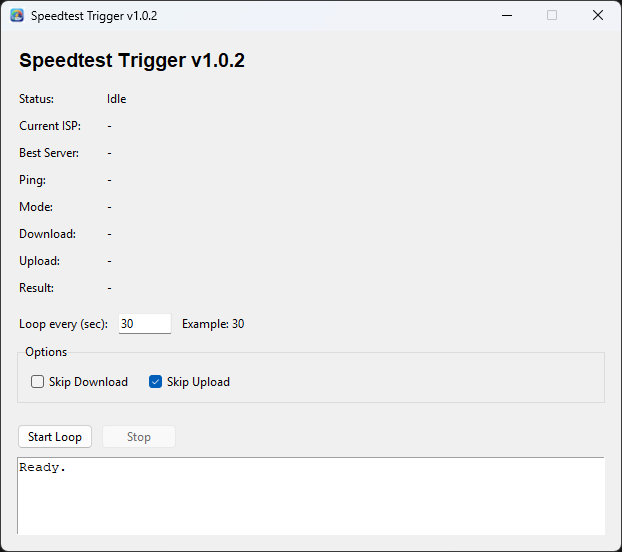

# Speedtest Trigger GUI

A lightweight desktop tool designed to help maintain stable internet performance by periodically checking your connection using a fast ISP, server, and ping check.

> [!NOTE]
> This tool helps maintain your internet speed at its peak, especially in cases where performance drops when no active speed test is running (which may indicate ISP throttling).

Built with Python and Tkinter, it serves as a lightweight alternative to running Speedtest in a web browser.

---

## Screenshot



---

## Features

- Fast connection check (no download or upload test)
- Automatic loop with configurable interval (e.g., every 30 seconds)
- Displays:
  - Current ISP (Telco)
  - Best server
  - Ping
- Start and stop controls
- Lightweight GUI with minimal resource usage
- Fully self-contained application

---

## Requirements

### Windows (Recommended)
- Download `speedtest_trigger_gui.exe` from the Releases page
- Run the application

---

### Linux (Source Run)

- Python 3
- Tkinter:
  ```
  sudo apt install python3-tk
  ```

- Install dependency:
  ```
  pip install requests
  ```

---

### Development Setup

#### Install Python

1. Download Python:  
   https://www.python.org/downloads/

2. Recommended Version:  
   Python 3.10 – 3.12

3. During installation:
   - Enable "Add Python to PATH"
   - Click Install Now

---

## Running the Application

```
python speedtest_trigger_gui.py
```

---

## Building Executable

### Windows

```
py build.py
```

### Linux

```
python3 build.py
```

Output:
```
dist/speedtest_trigger_gui
```

---

## How It Works

- Retrieves current ISP information
- Selects the best nearby server
- Measures latency (ping)
- Updates the interface
- Waits for the configured interval
- Repeats

---

## Notes

- This tool does not perform full speed tests
- Minimal bandwidth usage compared to traditional speedtest tools
- Recommended interval: 15–30 seconds

---

## License

This project is licensed under the MIT License. See the [LICENSE](./LICENSE) file for details.
